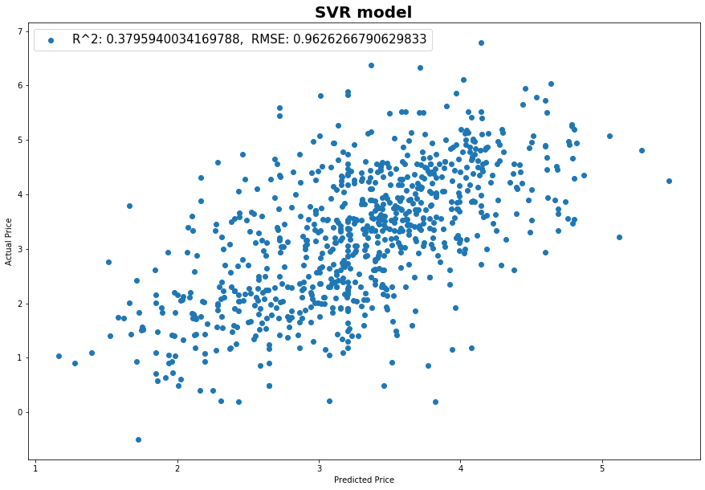
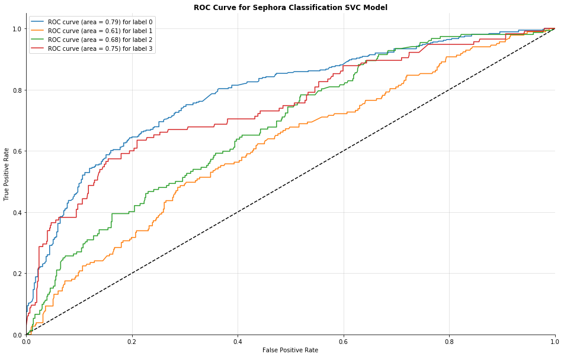

# Capstone: Sephora. Predicting prices based on Ingredients

## Table of Contents

[Directory Structure](#Directory-Structure)<br>
[Project Outline / Problem Statement](#Project-Outline-/-Problem-Statement)<br>
[Description of Data](#Description-of-Data)<br>
-[Size](#Size)<br>
-[Source](#Source)<br>
[Data Visualization](#Data-Visualization)<br>
[Conclusion](#Conclusion)<br>


## Directory Structure

```
.
├── capstone
    ├── 00_getting_slugs.ipynb
    ├── 01_getting_soups.ipynb
    ├── 02_getting_products_data.ipynb
    ├── 03_cleaning_data.ipynb
    ├── 04_eda.ipynb
    ├── 05_fuzzywuzzy_string_matching.ipynb
    ├── 06_regression_modeling.ipynb
    ├── 07_classification_modeling.ipynb
    ├── data
        ├── product_info.csv
        ├── product_urls.csv
        ├── product_urls2.csv
        ├── products_clean.csv
        ├── products_clean_eda.csv
        ├── products_fuzzywuzzy.csv
        ├── soups
    ├── plots
        ├── category_comparison.png
    ├── README.md
```

## Project Outline / Problem Statement

It is an assumption customers make that their skin care product price is dependent on the ingredients in this product. The goal of my projects was to see if I can predict prices of the products based on the ingredients. To accomplish this goal, I first had to gather my data. I used Sephora.com data for this. With the help of selenium, I was able to gather the urls that led to each product description page. Then I scraped each page to gather my data.

Some of the ingredients lists didn't pull properly. Through EDA and cleaning I was able to identify those variables. The ones that weren't able to read in correctly during the scrape I went ahead and filled manually. There were fewer than 20. The ones that weren't able to parse correctly the gathered ingredient page for the actual ingredient list, I filled in manually with the correct list from Sephora.com directly.

My plan was to implement several models on the ingredient list and use metrics such as R^2 and RMSE to compare the models. My y-variable was be price per oz. I featured engineered the y-variable using the gathered price displayed on the site and the size of the product. For comparison, I also ran Linear Regression using brand and category as my input. 

To see if I could get a better result, I also turned the model in to a classification problem. I used my knowledge gained from working as an esthetician to make decisions on the break up of the multiclasses. Similar process was folled for the classification problem as was for regression. 


---
## Description of Data
name of the column|description|break down|
|---|---|---|
|name|the name of the product as listed||
|brand|the brand that makes the product||
|category|category the product falls under|cleanser, eye-treatment-dark-circle-treatment, facial-treatment-masks, facial-treatments, lip-treatments, moisturizing-cream-oils-mists, sunscreen-sun-protection|
|price|the price listed in dollars||
|ingredients|list of ingredients in the product as listed||
|no_reviews|number of reviews the product has||
|hearts|number of people who added the product to their "loved" list||
|size1|first format the size was found in||
|size2|second format the size was found under||
|url|the original URL gathered with selenium||
|final_size|featured engineered size as collection of size1 and size2||
|price_per_ounce|featured engineered price, price / final_size||

---
### Size

   -2767 product url were gathered.

---

### Source

The data was gathered from [Sephore](https://www.sephora.com/)

  - [cleanser](https://www.sephora.com/shop/cleanser)
  - [eye-treatment-dark-circle-treatment](https://www.sephora.com/shop/eye-treatment-dark-circle-treatment)
  - [facial-treatment-masks](https://www.sephora.com/shop/facial-treatment-masks)
  - [lip-treatments](https://www.sephora.com/shop/lip-treatments)
  - [moisturizing-cream-oils-mists](https://www.sephora.com/shop/moisturizing-cream-oils-mists)
  - [sunscreen-sun-protection](https://www.sephora.com/shop/sunscreen-sun-protection)


---
## Data Visualization





-------------------------------------

## Conclusion

Unfortunately, neither the regression nor the classification was able to produce result much better than the baseline. It appeared that only using ingredients wasn't a fully good predictor of prices. I did achieve significantly better results with using the brand and category as input variables. 

---

